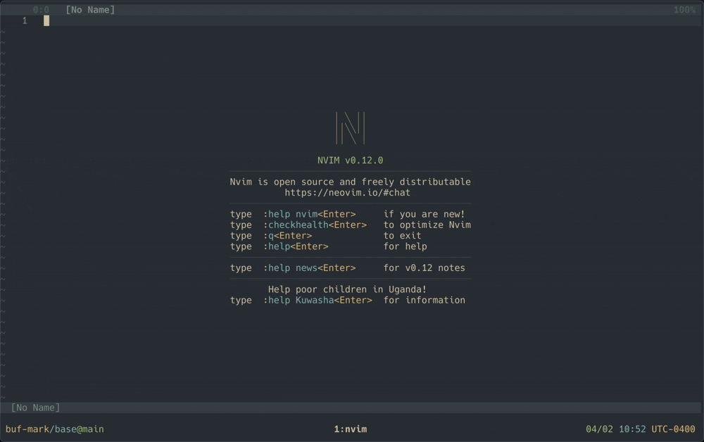
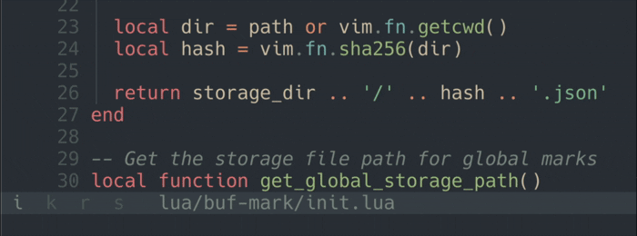
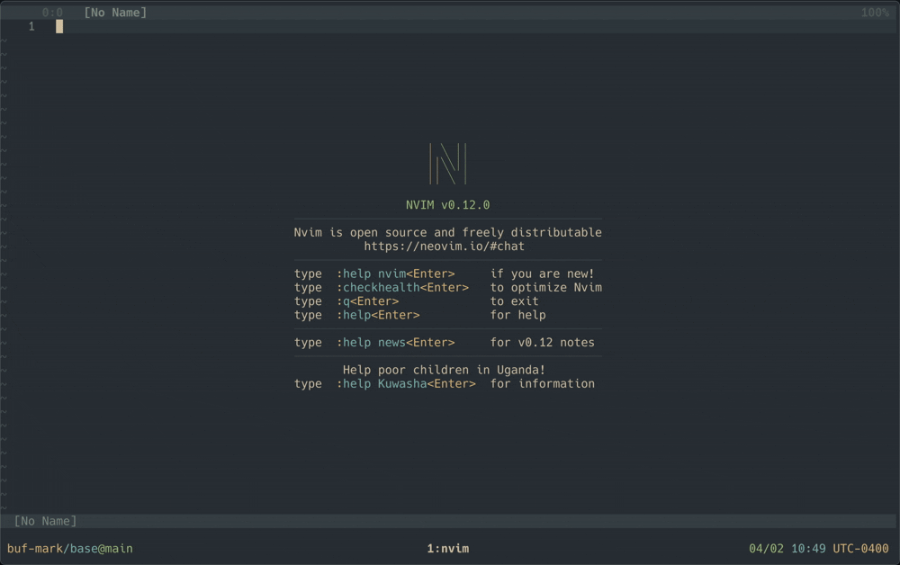

# buf-mark

A Neovim plugin that provides vim-like marks for buffer switching.

Buf-marks turn buffer switching into muscle memory by assigning meaningful, mnemonic characters to buffers.

Mark your:
- `init.lua` with `i`
- `main.go` with `m`
- or your `README.md` with `r`

In doing so you establish a personal shorthand that's faster than fuzzy finding and more intentional than cycling.



### Features

- Jumping to a buf-mark restores your cursor to where you left off
- Marks persist across sessions, allowing them to become a stable part of your workflow
- **Local** buf-marks are scoped to the current working directory
- **Global** buf-marks can be set and accessed from any working directory
- Provides a status module for displaying buf-marks in statusline or tabline
- Integrates with fuzzy finders like Telescope and fzf-lua
- Supports migrating buf-marks between git worktrees

### Parallels with Native Vim Marks

Buf-marks borrow the local/global distinction from native Vim marks:

| Scope | native marks | buf-marks |
|-------|--------------|-----------|
| **Local** | Lowercase marks (`a`-`z`) are local to a single file | Local marks (`a`-`z`, `0`-`9`, and symbols) are local to the current working directory |
| **Global** | Uppercase marks (`A`-`Z`) are global and can jump across files | Global marks (`A`-`Z`) are accessible from any working directory |

The mental model is the same: lowercase for nearby things, uppercase for things you need to reach from anywhere.

Because local marks are scoped per working directory, you can reuse the same characters across different codebases.
For example, `m` can point to `main.go` in one project and `models.py` in another.
Each project gets its own independent set of marks.

### Differences from Native Vim Marks

| Feature | native marks | buf-marks |
|---------|------------------|----------|
| **Navigation** | Jump to fixed line/column | Jump to buffer + restore last cursor position |
| **Persistence** | Saved globally in shada file, shared across all sessions | Local marks and global marks are persisted as JSON |
| **Use Case** | Bookmarking locations within files | Quick buffer switching |

## Usage

The default keymaps mirror native marks but are prefixed with `<leader>`:

| keymap | function |
|--------|----------|
| `<leader>m{char}` | Set buf-mark `{char}` for the current buffer |
| `<leader>'{char}` | Jump to buf-mark `{char}` |

### Example Workflow

1. Open a file (e.g., `init.lua`)
2. Press `<leader>mi` to mark the current buffer with character `i`
3. Navigate to another file
4. Press `<leader>'i` to go back to `init.lua` where you left it
5. Close and reopen Neovim to find your marks are still there

## Installation

### [vim.pack](https://neovim.io/doc/user/pack.html) (Neovim 0.12+)

```lua
vim.pack.add({ 'https://github.com/ryanburda/buf-mark' })
require("buf-mark").setup()
```

### [lazy.nvim](https://github.com/folke/lazy.nvim)

```lua
{
  "ryanburda/buf-mark",
  config = function()
    require("buf-mark").setup()
  end,
}
```

### Setup Options

```lua
require("buf-mark").setup({
  -- Set to true to enable default keymaps
  keymaps = true,
  -- Set to true to persist marks between Neovim sessions.
  -- Marks will be saved per working directory
  -- (e.g., marks in ~/code/project-a are separate from ~/code/project-b)
  persist = true,
  -- Customize the optional status highlight groups. (See Status section of README for more details)
  -- By default, the status module uses `StatusLine` for the current buffer's mark
  -- and `StatusLineNC` for marks of non-current buffers. You can customize these
  -- highlight groups to match your colorscheme or configuration.
  status = {
    hl_current = 'StatusLine',       -- Highlight group for current buffer's mark
    hl_non_current = 'StatusLineNC', -- Highlight group for non-current buffers' marks
  }
})
```

For alternative keymap ideas, see [Keymap Suggestions](docs/keymap_suggestions.md).

### Optional Dependencies

- [fzf-lua](https://github.com/ibhagwan/fzf-lua) - Required if using fzf-lua pickers
- [telescope.nvim](https://github.com/nvim-telescope/telescope.nvim) - Required if using telescope pickers
- [nvim-web-devicons](https://github.com/nvim-tree/nvim-web-devicons) or [mini.icons](https://github.com/echasnovski/mini.icons) - Colored file type icons in the pickers. Falls back gracefully if neither is installed.


## API

### User Commands

> #### `:BufMarkList`
>
> Lists all buf-marks (local and global) with their associated files. The output displays:
> - Mark character
> - File path (relative to current directory)
>
> Example output:
> ```
> mark  file
>  a    src/config.lua
>  b    README.md
>  c    path/to/file.txt
> ```
>
> #### `:BufMarkSet <char>`
>
> Set a buf-mark for the current buffer using the specified character.
> Uppercase letters (`A`-`Z`) create global marks; all other characters create local marks.
>
> **Examples:**
> ```
> :BufMarkSet a
> :BufMarkSet A
> ```
>
> #### `:BufMarkDelete <char>`
>
> Delete the buf-mark for the specified character.
>
> **Examples:**
> ```
> :BufMarkDelete a
> :BufMarkDelete A
> ```
> 
> #### `:BufMarkGoto <char>`
> 
> Jump to the buffer associated with the specified mark character.
> 
> **Example:**
> ```
> :BufMarkGoto a
> ```
> 
> #### `:BufMarkNext [count]`
>
> Jump to the next buf-mark in sorted order. Wraps around to the first mark after the last. If the current buffer has no mark, jumps to the first mark.
>
> **Examples:**
> ```
> :BufMarkNext
> :BufMarkNext 3
> ```
>
> #### `:BufMarkPrev [count]`
>
> Jump to the previous buf-mark in sorted order. Wraps around to the last mark before the first. If the current buffer has no mark, jumps to the last mark.
>
> **Examples:**
> ```
> :BufMarkPrev
> :BufMarkPrev 2
> ```
>
> #### `:BufMarkGetStoragePath [path]`
>
> Print the storage file path for a working directory. Defaults to the current working directory if no path is provided.
>
> **Examples:**
> ```
> :BufMarkGetStoragePath
> :BufMarkGetStoragePath ~/code/my-project
> ```
>
> #### `:BufMarkRemoveStorageFile <path>`
>
> Delete the storage file for a working directory. This removes all persisted buf-marks for the given directory.
>
> **Example:**
> ```
> :BufMarkRemoveStorageFile ~/code/my-project
> ```

### Lua API

> #### `setup(opts)`
> 
> Initialize the plugin with optional configuration.
> 
> **Parameters:**
> - `opts` (table, optional): Configuration options
>   - `keymaps` (boolean): Enable/disable default keymaps (default: `true`)
>   - `persist` (boolean): Enable mark persistence between sessions, saved per working directory (default: `true`)
>   - `status` (table, optional): Status module configuration
>     - `hl_current` (string): Highlight group for current buffer's mark (default: `'StatusLine'`)
>     - `hl_non_current` (string): Highlight group for non-current buffers' marks (default: `'StatusLineNC'`)
> 
> **Example:**
> ```lua
> require("buf-mark").setup({
>   keymaps = true,
>   persist = true,
>   status = {
>     hl_current = 'StatusLine',
>     hl_non_current = 'StatusLineNC',
>   }
> })
> ```
> 
> #### `list()`
>
> Returns all buf-marks (local and global) as a table mapping characters to file paths.
>
> **Returns:**
> - `table`: A table where keys are mark characters and values are file paths
>
> **Example:**
> ```lua
> local marks = require("buf-mark").list()
> for char, path in pairs(marks) do
>   print("Mark " .. char .. " -> " .. path)
> end
> ```
>
> #### `list_pretty()`
>
> Display all buf-marks (local and global) with their associated buffer information in a formatted view.
>
> **Example:**
> ```lua
> require("buf-mark").list_pretty()
> ```
>
> #### `set(char)`
>
> Set a buf-mark for the current buffer. Uppercase letters (`A`-`Z`) set global marks;
> all other characters set local marks.
>
> **Parameters:**
> - `char` (string): A single character to use as the mark identifier
>
> **Examples:**
> ```lua
> require("buf-mark").set('a')  -- local mark
> require("buf-mark").set('A')  -- global mark
> ```
> 
> #### `delete(char)`
>
> Delete a buf-mark. Uppercase letters delete global marks; all other characters delete local marks.
>
> **Parameters:**
> - `char` (string): The mark character to delete
>
> **Examples:**
> ```lua
> require("buf-mark").delete('a')  -- local mark
> require("buf-mark").delete('A')  -- global mark
> ```
>
> #### `goto(char)`
>
> Jump to the buffer associated with the given mark. Uppercase letters jump to global marks;
> all other characters jump to local marks.
>
> **Parameters:**
> - `char` (string): The mark character to jump to
>
> **Examples:**
> ```lua
> require("buf-mark").goto('a')  -- local mark
> require("buf-mark").goto('A')  -- global mark
> ```
> 
> #### `next(count)`
>
> Jump to the next buf-mark in sorted order. Wraps around.
>
> **Parameters:**
> - `count` (number, optional): Number of marks to skip forward (default: `1`)
>
> **Example:**
> ```lua
> require("buf-mark").next()
> require("buf-mark").next(3)
> ```
>
> #### `prev(count)`
>
> Jump to the previous buf-mark in sorted order. Wraps around.
>
> **Parameters:**
> - `count` (number, optional): Number of marks to skip backward (default: `1`)
>
> **Example:**
> ```lua
> require("buf-mark").prev()
> require("buf-mark").prev(2)
> ```
>
> #### `get_storage_path(path)`
>
> Get the storage file path for a given working directory.
>
> **Parameters:**
> - `path` (string, optional): The working directory to get the storage path for. Defaults to the current working directory.
>
> **Returns:**
> - `string`: The absolute path to the JSON storage file
>
> **Example:**
> ```lua
> local storage_path = require("buf-mark").get_storage_path()
> -- e.g. "~/.local/share/nvim/buf_mark/abc123...def.json"
> ```
>
> #### `remove_storage_file(path)`
>
> Delete the storage file for a given working directory. This removes all persisted buf-marks for that directory.
>
> **Parameters:**
> - `path` (string): The working directory whose storage file should be deleted
>
> **Example:**
> ```lua
> require("buf-mark").remove_storage_file("~/code/my-project")
> ```
>
> #### `load_marks(path, opts)`
>
> Load buf-marks from a given working directory.
>
> **Parameters:**
> - `path` (string, optional): Path to the source working directory. Defaults to the current working directory.
> - `opts` (table, optional): Options table
>   - `force` (boolean): When `true`, overwrite existing marks. (default: `true`)
>   - `rebase` (boolean): When `true`, rebase file paths from the source directory to the current working directory. (default: `false`)
>
> **Examples:**
> ```lua
> -- Load marks for the current working directory (used internally at startup)
> require("buf-mark").load_marks()
>
> -- Load marks from another working directory without overwriting, rebasing paths.
> -- This can be used to load the buf-marks of another git worktree into the current worktree.
> require("buf-mark").load_marks("~/code/my-project/other_worktree", { force = false, rebase = true })
>
> -- Or load marks from a completely different project to easily jump to files in another working directory.
> require("buf-mark").load_marks("~/code/my-other-project", { force = true, rebase = false })
> ```
>
## Events

A `BufMarkChanged` event is fired whenever:
- a buf-mark is added or deleted
- the user enters or deletes a buffer. (`BufEnter`, `BufDelete`)

You can respond to this event by creating an autocommand like so:
```lua
vim.api.nvim_create_autocmd("User", { pattern = "BufMarkChanged", ... })
```

**Use cases:**
- Implement custom mark visualization similar to [Status](#status) shown below
- Display notifications when marks change

## Status

### `buf-mark.status`

The `buf-mark.status` module provides a function to display buf-marks **for currently open buffers**.
This is useful for integrating buf-mark information into statuslines, tablines, or other UI components.
Marks are shown in alphabetical order with the mark of the current buffer highlighted.

This serves as a compact alternative to a traditional tabline. Instead of showing
full filenames for every open buffer, you see only the single-character marks you
chose, giving you the same at-a-glance context in a fraction of the space.



**Why only show buf-marks for open buffers?**

Over time you'll accumulate marks. Displaying all marks would create visual clutter and
make it harder to find the information you're actually interested in. By showing only
marks for currently open buffers, the status display provides focus and context for the
specific problem you're currently working on. If you need to see all marks, you can list
them separately using `:BufMarkList` or by using one of the [fuzzy finder integrations](#fuzzy-finder-integrations).

### Setup

> #### Usage with statusline
>
> **NOTE:** also shows current file (`%f`) name and modified flag (`%m`).
> 
> ```lua
> vim.o.statusline = '% %f %m'
> ```
> 
> #### Usage with lualine
> 
> ```lua
> require('lualine').setup({
>   sections = {
>     lualine_a = {require('buf-mark.status').get},
>   }
> })
> ```

### Functions
> #### `next(count)`
> 
> Jump to the next buf-mark in sorted order, considering only marks for currently open buffers. Wraps around.
> 
> **Parameters:**
> - `count` (number, optional): Number of marks to skip forward (default: `1`)
> 
> **Example:**
> ```lua
> require("buf-mark.status").next()
> require("buf-mark.status").next(2)
> ```
> 
> #### `prev(count)`
> 
> Jump to the previous buf-mark in sorted order, considering only marks for currently open buffers. Wraps around.
> 
> **Parameters:**
> - `count` (number, optional): Number of marks to skip backward (default: `1`)
> 
> **Example:**
> ```lua
> require("buf-mark.status").prev()
> require("buf-mark.status").prev(2)
> ```


## Fuzzy Finder Integrations

Buf-marks works with the following:
- [fzf-lua](https://github.com/ibhagwan/fzf-lua)
- [telescope.nvim](https://github.com/nvim-telescope/telescope.nvim)



No additional setup is required to call any of the picker functions. Calling a function for a fuzzy finder
that is not installed will result in an error. Each fuzzy finder integration exposes the following functions:

#### `list()`

Browse all buf-marks and jump to the selected one. The preview shows the file at the last known
cursor position. Press `ctrl-x` to delete the selected mark.

**NOTE:** Buf-marks are meant to be a shorthand you can recall from memory. That's what makes them fast.
But sometimes you need a nudge to remember what you mapped where, and that's where fuzzy finding
comes in. It's there if you need it, but try not to rely on it too much. If you're reaching for
this picker every time, consider whether your marks could be more memorable.

#### `worktrees()`

Lists other git worktrees that have saved buf-marks. Selecting a worktree loads its marks into
your current session. File paths are rebased so they point to the equivalent files in the current
working directory. This is useful when you create a new worktree and want to bring over marks you
already set up in another one. Existing marks are not overwritten.

#### `projects()`

Lists all other working directories that have saved buf-marks. Selecting a working directory loads
its marks into your current session using the original, absolute file paths (no rebasing). This
lets you quickly pull in marks from a different project so you can jump to those files without
switching directories. Existing marks are not overwritten.

### fzf-lua

```lua
require("buf-mark.fzf_lua").list()
require("buf-mark.fzf_lua").worktrees()
require("buf-mark.fzf_lua").projects()
```

### telescope.nvim

```lua
require("buf-mark.telescope").list()
require("buf-mark.telescope").worktrees()
require("buf-mark.telescope").projects()
```

## Do I need this plugin?

Native Vim marks can actually be used to achieve similar buffer-switching behavior. For an alternative
that doesn't require a plugin, see [Using Native Marks](docs/using_native_marks.md).

**TLDR:** This plugin provides additional features like ergonomic keymaps, mark persistence across sessions,
and status line integrations, but the native marks approach may be sufficient for many workflows.


## License

MIT

## Contributing

Contributions are welcome! Please feel free to submit a Pull Request.
